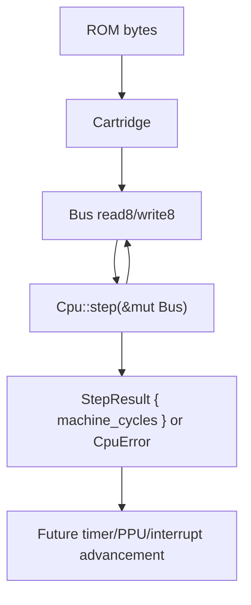

# Phase 2: CPU Core Foundation - Research

**Researched:** 2026-05-02
**Domain:** Rust DMG Game Boy CPU core foundation
**Confidence:** HIGH

<user_constraints>
## User Constraints (from CONTEXT.md)

### Locked Decisions
- D-01: Add a focused reusable CPU module, expected to be `src/cpu.rs` or an equivalent module exported from `src/lib.rs`. Keep CPU logic out of `src/main.rs`.
- D-02: Provide a documented DMG post-boot constructor such as `Cpu::new_dmg()`. It should start at `PC = 0x0100`, `SP = 0xFFFE`, and use the documented DMG register defaults from project docs, including `A = 0x01`, `B = 0x00`, `C = 0x13`, `D = 0x00`, `E = 0xD8`, `H = 0x01`, `L = 0x4D`, and `F = 0xB0` unless research finds a stronger project-local contradiction. Always mask the lower nibble of `F` to zero.
- D-03: Provide test-oriented construction or mutation helpers so unit tests can set registers, `PC`, and `SP` without relying on hidden setup or CPU execution side effects.
- D-04: Instruction execution should happen through a `step`-style API that receives a mutable `Bus` or equivalent. Opcode fetch and operand reads/writes must use `Bus::read8` / `Bus::write8`; CPU code should not read cartridge bytes or memory arrays directly.
- D-05: `step` should return a structured outcome or `Result` that includes elapsed machine cycles. Machine cycles are the primary reporting unit for Phase 2; later devices can translate to T-cycles/dots as needed.
- D-06: The CPU core should not print to stdout/stderr. The CLI remains a boundary around loading/reporting only.
- D-07: Unimplemented opcodes should fail deterministically through a structured unsupported-opcode result/error containing the opcode and opcode `PC`. Do not panic, exit the process, or silently treat unimplemented opcodes as `NOP`.
- D-08: Unsupported-opcode behavior should be documented and tested. Preferred behavior is to preserve pre-step CPU state on unsupported opcodes while still reporting the opcode address and byte; if the planner chooses PC advancement during fetch, that choice must be explicit in tests.
- D-09: Keep instruction implementation aligned to the roadmap slices: basic fetch/register state first, then `NOP`/`HALT`/`STOP` placeholders and basic 8-bit loads, then arithmetic/logical helpers, then control-flow/stack helpers, then the CB-prefix boundary.
- D-10: `HALT` and `STOP` are placeholders in Phase 2. They may record halted/stopped state and return deterministic cycles, but must not implement interrupt wake behavior, the HALT bug, speed switching, timer effects, or CGB behavior.
- D-11: Arithmetic/logical helpers should prioritize flag correctness with targeted tests for `Z`, `N`, `H`, and `C`, especially lower-nibble carry/borrow behavior. `DAA` should remain deferred unless planned as a small isolated, test-heavy addition inside the arithmetic slice.
- D-12: Stack helpers must use Bus-backed reads/writes and little-endian push/pop behavior. CPU code should not bypass the Bus for stack memory.
- D-13: Recognize `0xCB` as a prefixed opcode boundary in Phase 2 even if CB operations themselves are not implemented yet.
- D-14: Prefer a CB skeleton that fetches or identifies the second opcode byte and returns a structured unsupported-CB result/error containing the subopcode and original opcode `PC`.
- D-15: If CB operations are deferred, every CB opcode should fail deterministically. Do not implement broad bit/rotate/shift behavior unless it is deliberately scoped into the `02-05` plan slice.
- D-16: Decoder organization is flexible. A `match`-based decoder is acceptable at this stage if helpers and tests make later expansion straightforward.
- D-17: Phase 2 validation should focus on unit tests for CPU initialization, register/flag helpers, Bus-backed fetch, `PC` advancement for implemented instructions, implemented opcode side effects, stack behavior, and cycle returns.
- D-18: ROM-driven execution, deterministic timeouts, and serial pass/fail capture remain Phase 2.1. Phase 2 should still leave a clean stepping surface that Phase 2.1 can drive.
- D-19: Keep the implementation dependency-free unless a dependency removes real emulator-correctness risk. For Phase 2, the expected path is standard-library Rust plus Cargo tests.

### the agent's Discretion
- Exact type names for `Cpu`, `Registers`, flags, cycle counts, and CPU errors/outcomes.
- Whether CPU state is exposed through public fields, getters, snapshots, or test-only helpers, provided tests can inspect important state cleanly.
- Exact decoder shape, helper function boundaries, and file splits inside the CPU module.
- Exact wording of unsupported-opcode errors, provided they include opcode and opcode-address context.
- Exact test fixture helpers and assertion style.

### Deferred Ideas (OUT OF SCOPE)
- Serial transfer register handling and deterministic ROM test harnessing: Phase 2.1.
- Timer registers, `IF`/`IE`/`IME`, delayed `ei`, interrupt service, and HALT wake behavior: Phase 3.
- Expanded blargg/mooneye validation harnessing: Phase 4.
- PPU mode/access restrictions and interrupt hooks: Phase 5.
- Nintendo boot ROM emulation, full rendering, Joypad input, broad MBC support, save RAM, APU/audio, host UI, and CGB behavior: v2 or later.
</user_constraints>

<architectural_responsibility_map>
## Architectural Responsibility Map

Single-tier Rust emulator core. Phase 2 capabilities reside in the reusable core layer.

| Capability | Primary Owner | Secondary Owner | Rationale |
|------------|---------------|-----------------|-----------|
| CPU register and flag state | `src/cpu.rs` | `src/lib.rs` export | CPU owns LR35902 state; library export exposes it to tests and future hosts. |
| Opcode fetch/decode/execute | `src/cpu.rs` | `src/bus.rs` | CPU owns instruction behavior, but all memory reads and writes pass through Bus. |
| Cartridge ROM bytes | `src/cartridge.rs` | `src/bus.rs` | Existing cartridge behavior remains behind Bus; CPU must not read ROM directly. |
| Work RAM, HRAM, I/O, IE | `src/bus.rs` | Future devices | Bus already models basic storage ranges and remains the CPU-visible boundary. |
| Timing handoff | `StepResult` in `src/cpu.rs` | Future timer/PPU/interrupt modules | Phase 2 reports machine cycles without advancing future devices yet. |
</architectural_responsibility_map>

<research_summary>
## Summary

Phase 2 should build a deliberately narrow CPU foundation: state, flags, Bus-backed fetch/decode/execute, staged instruction groups, and cycle reporting. The established emulator approach is to keep CPU state explicit, keep memory access behind a Bus, implement instruction families in small tested slices, and make unsupported behavior deterministic while coverage is incomplete.

The Game Boy CPU uses 8-bit registers `A`, `B`, `C`, `D`, `E`, `H`, `L`, flag register `F`, and 16-bit `SP`/`PC`. The meaningful flag bits are `Z = 0x80`, `N = 0x40`, `H = 0x20`, and `C = 0x10`; the lower nibble of `F` should remain zero. For this v1 milestone, the emulator should skip boot ROM emulation and start from documented DMG post-boot state at `PC = 0x0100`.

**Primary recommendation:** implement `src/cpu.rs` with explicit `Cpu`, `Registers`, `StepResult`, and `CpuError` types, then add the five roadmap plan slices sequentially because they all modify the same CPU module.
</research_summary>

<standard_stack>
## Standard Stack

### Core
| Library | Version | Purpose | Why Standard |
|---------|---------|---------|--------------|
| Rust standard library | stable | Core CPU structs, arithmetic helpers, `Result` errors, unit tests | The crate is dependency-free and Phase 2 does not need external crates. |
| Cargo test harness | stable | CPU unit tests and existing CLI integration tests | Already used by the repository and CI. |

### Supporting
| Library | Version | Purpose | When to Use |
|---------|---------|---------|-------------|
| None | n/a | n/a | Avoid adding dependencies for CPU decode and arithmetic helpers in Phase 2. |

### Alternatives Considered
| Instead of | Could Use | Tradeoff |
|------------|-----------|----------|
| Hand-written `match` decoder | Generated opcode tables | Generated tables reduce repetition later, but the Phase 2 subset is small enough that hand-written matches are easier to review. |
| Public CPU fields | Accessor methods/snapshots | Public fields make tests simple; accessors preserve invariants. Either is acceptable if `F` low nibble masking is guaranteed. |
| `u32` cycle counts | `u8` machine-cycle counts | `u8` is enough for individual Phase 2 instructions; `u32` is more future-proof. Use one named field consistently. |

**Installation:** No dependency installation required.
</standard_stack>

<architecture_patterns>
## Architecture Patterns

### System Architecture Diagram



### Recommended Project Structure

```text
src/
├── lib.rs          # pub mod bus; pub mod cartridge; pub mod cpu;
├── bus.rs          # existing CPU-visible memory boundary
├── cartridge.rs    # existing ROM-only cartridge behavior
└── cpu.rs          # new Phase 2 CPU state, flags, decode, execution, tests
```

### Pattern 1: Explicit CPU State With Invariant Helpers
**What:** Model registers in a `Registers` struct and centralize flag manipulation in methods such as `set_flag`, `flag`, and `set_f`.
**When to use:** Any instruction that reads or mutates flags, paired registers, `SP`, or `PC`.
**Example:**
```rust
const FLAG_Z: u8 = 0x80;
const FLAG_N: u8 = 0x40;
const FLAG_H: u8 = 0x20;
const FLAG_C: u8 = 0x10;

fn set_f(&mut self, value: u8) {
    self.f = value & 0xF0;
}
```

### Pattern 2: Bus-Backed Instruction Helpers
**What:** CPU helpers should fetch immediates and read/write memory through `Bus`.
**When to use:** Opcode fetch, immediate operands, `(HL)` memory operands, stack push/pop, and absolute/high memory loads.
**Example:**
```rust
fn fetch8(&mut self, bus: &Bus) -> u8 {
    let value = bus.read8(self.registers.pc);
    self.registers.pc = self.registers.pc.wrapping_add(1);
    value
}
```

### Pattern 3: Deterministic Unsupported Opcode Results
**What:** Unsupported opcodes return `CpuError` with opcode and PC context.
**When to use:** Any opcode outside the currently planned staged subset, including CB-prefixed subopcodes until implemented.
**Example:**
```rust
Err(CpuError::UnsupportedOpcode { opcode, pc })
```

### Anti-Patterns to Avoid
- **Reading ROM directly in CPU:** Bypasses Bus and makes future cartridge/device timing behavior hard to attach.
- **Treating unknown opcodes as NOP:** Produces false positives and hides missing instruction coverage.
- **Embedding CPU execution in the CLI:** Couples host behavior to core timing before the emulator core is testable.
- **Letting `F` low nibble carry data:** The lower nibble is not a flag area and should be masked to zero.
- **Pulling timers/interrupts into Phase 2:** This would blur the boundary with Phase 3 and make HALT behavior premature.
</architecture_patterns>

<common_pitfalls>
## Common Pitfalls

### Pitfall 1: Flag Half-Carry and Borrow Errors
**What goes wrong:** `H` is set from full-byte overflow instead of lower-nibble carry/borrow.
**Why it happens:** Arithmetic looks trivial until flag semantics are tested on boundary values like `0x0F`, `0x10`, and `0x00`.
**How to avoid:** Add tests for `INC 0x0F`, `DEC 0x10`, `ADD 0x0F + 0x01`, `SUB 0x10 - 0x01`, and compare/carry edge cases.
**Warning signs:** Arithmetic returns the right `A` value but flag tests fail on nibble boundaries.

### Pitfall 2: PC Advancement on Unsupported Opcodes
**What goes wrong:** An unsupported opcode advances `PC`, making error recovery and diagnostics harder to reason about.
**Why it happens:** Implementations often fetch first, then decode, which mutates `PC` before discovering an unsupported opcode.
**How to avoid:** Peek before mutating for unsupported paths, or explicitly roll back. Tests should assert `PC` remains at the unsupported opcode address.
**Warning signs:** `UnsupportedOpcode` reports a PC one byte after the opcode.

### Pitfall 3: Stack Endianness Reversal
**What goes wrong:** `CALL`, `RET`, `PUSH`, and `POP` write/read high and low bytes in the wrong order.
**Why it happens:** Stack pointer movement and little-endian memory layout are easy to mix up.
**How to avoid:** Test push/pop round trips and inspect the exact bytes at `SP` and `SP + 1`.
**Warning signs:** `RET` jumps to byte-swapped addresses like `0x3412` instead of `0x1234`.

### Pitfall 4: Overbuilding HALT/STOP
**What goes wrong:** HALT bug, interrupt wake, speed switching, or timer interaction gets implemented before interrupt/timer state exists.
**Why it happens:** HALT and STOP are deceptively small opcodes but depend on later hardware state.
**How to avoid:** In Phase 2, set placeholder state and return deterministic cycles only.
**Warning signs:** Phase 2 CPU code starts owning `IME`, `IF`, timer, or CGB speed behavior.
</common_pitfalls>

<validation_architecture>
## Validation Architecture

Phase 2 should validate via focused Rust unit tests inside `src/cpu.rs`. These tests should build small in-memory ROM-only cartridges and a `Bus`, then call CPU helpers or `Cpu::step`.

Required validation groups:
- CPU defaults: `Cpu::new_dmg()` sets post-boot registers and masks `F`.
- Fetch/decode: implemented opcodes advance `PC` by exact instruction length; unsupported opcodes preserve the opcode `PC`.
- Loads: immediate/register/memory load opcodes move bytes through registers and Bus.
- Flags: arithmetic/logical instructions cover `Z`, `N`, `H`, and `C` edge cases.
- Stack/control flow: push/pop/call/return/jump behavior uses Bus-backed memory and little-endian addresses.
- Cycles: every implemented opcode returns expected machine cycles.
- CB boundary: `0xCB` reports an unsupported CB error with subopcode and original PC until CB operations are intentionally implemented.

Do not require ROM-driven validation in Phase 2; that is Phase 2.1.
</validation_architecture>

<open_questions>
## Open Questions

1. **Should Phase 2 implement `DAA`?**
   - What we know: `DAA` is flag-sensitive and easy to get wrong.
   - What's unclear: The roadmap does not list it explicitly in the arithmetic slice.
   - Recommendation: Defer `DAA` unless implementation can be isolated with strong tests and does not delay the listed arithmetic/logical groups.

2. **Should cycle counts use `u8`, `u16`, or `u32`?**
   - What we know: Individual Phase 2 instruction machine-cycle counts are small.
   - What's unclear: Later aggregate stepping APIs may want wider counts.
   - Recommendation: Use a named `machine_cycles` field; `u8` is acceptable now, `u32` is acceptable if future aggregation convenience is preferred.
</open_questions>

<sources>
## Sources

### Primary (HIGH confidence)
- `.planning/ROADMAP.md` - Phase 2 scope, requirements, success criteria, and plan slices.
- `.planning/REQUIREMENTS.md` - `BOOT-01` and `CPU-01` through `CPU-06`.
- `.planning/phases/02-cpu-core-foundation/02-CONTEXT.md` - locked implementation decisions for Phase 2.
- `docs/gameboy_architecture_summary.md` - DMG registers, flags, timing units, and post-boot values.
- `docs/hot_to_proceed.md` - project implementation order and Bus-centered architecture.
- `src/bus.rs` - existing Bus API CPU must use.
- `src/cartridge.rs` - existing cartridge behavior and unsupported-error pattern.

### Secondary (MEDIUM confidence)
- `.planning/phases/01-cartridge-and-bus-foundation/01-CONTEXT.md` - prior phase decisions and Bus/cartridge boundaries.

### Tertiary (LOW confidence - needs validation)
- None used.
</sources>

<metadata>
## Metadata

**Research scope:**
- Core technology: Rust CPU core module for LR35902/SM83 DMG behavior.
- Ecosystem: local Cargo test harness, existing Bus and Cartridge modules.
- Patterns: explicit state structs, Bus-backed fetch/write, deterministic unsupported errors.
- Pitfalls: flag math, PC behavior, stack endianness, premature HALT/interrupt behavior.

**Confidence breakdown:**
- Standard stack: HIGH - the repository is dependency-free Rust and Phase 2 needs no external library.
- Architecture: HIGH - the project already locked Bus-centered module separation.
- Pitfalls: HIGH - local docs identify flags, HALT, timer/interrupt timing, and PPU deferrals.
- Code examples: MEDIUM - examples are implementation sketches to guide planning, not compiled source.

**Research date:** 2026-05-02
**Valid until:** Stable hardware/domain notes; recheck if project scope changes to boot ROM, CGB, or broad instruction-table generation.
</metadata>

---

*Phase: 02-cpu-core-foundation*
*Research completed: 2026-05-02*
*Ready for planning: yes*
