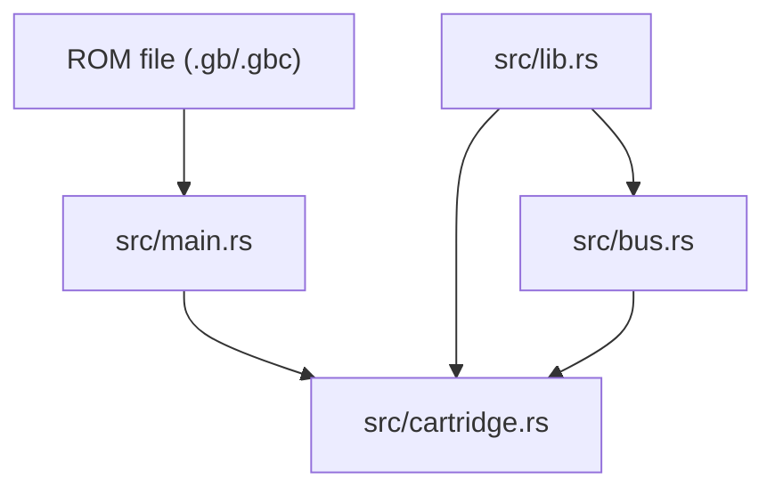

<!-- generated-by: gsd-doc-writer -->
# Architecture

GameGirl is a Rust Game Boy emulator foundation. The current executable accepts a `.gb` or `.gbc` path, validates and loads ROM bytes through the cartridge module, and exposes reusable core modules for cartridge metadata and DMG-style memory-bus access.

## System Overview

The system is organized as a small Rust binary plus a reusable library crate. The binary in `src/main.rs` owns command-line argument handling and user-facing errors. Emulator-domain behavior lives behind `src/lib.rs`, which exports `cartridge` and `bus` modules. ROM files are the primary input today; the observable output is either a successful byte-count message or a clear loading/parsing error.

## Component Diagram



## Data Flow

1. `src/main.rs` reads the first command-line argument and checks that the path extension is `.gb` or `.gbc`.
2. The CLI calls `game_girl::cartridge::load_rom_file`, which reads bytes with `std::fs::read`.
3. `Cartridge::from_bytes` parses the cartridge header, validates supported ROM/RAM size codes, and rejects unsupported cartridge types.
4. `Bus::new` accepts a `Cartridge` and owns the CPU-visible memory backing used by the currently implemented ranges: cartridge ROM, WRAM, OAM, I/O registers, HRAM, and interrupt enable.
5. Future CPU code should call `Bus::read8` and `Bus::write8` instead of reading cartridge or RAM storage directly.

## Key Abstractions

| Abstraction | Location | Role |
|-------------|----------|------|
| `Cartridge` | `src/cartridge.rs` | Owns ROM bytes and exposes ROM-only cartridge reads and writes. |
| `CartridgeHeader` | `src/cartridge.rs` | Stores parsed title, type, size, checksum, entry-point, logo, and CGB-flag metadata. |
| `CartridgeType` | `src/cartridge.rs` | Distinguishes ROM-only cartridges from currently unsupported cartridge type codes. |
| `CartridgeError` | `src/cartridge.rs` | Represents I/O, too-short, unsupported type, ROM-size, and RAM-size errors. |
| `validate_rom_bytes` | `src/cartridge.rs` | Checks that a ROM is large enough to contain the full cartridge header region. |
| `load_rom_file` | `src/cartridge.rs` | Loads and validates a ROM file, returning the raw bytes for the CLI. |
| `load_cartridge_file` | `src/cartridge.rs` | Loads a ROM file into a reusable `Cartridge`. |
| `Bus` | `src/bus.rs` | Routes 16-bit address reads and writes to cartridge ROM and owned memory regions. |
| `Bus::read8` | `src/bus.rs` | Reads one byte from the DMG address space. |
| `Bus::write8` | `src/bus.rs` | Writes one byte to writable DMG address ranges and ignores unusable ranges. |

## Directory Structure Rationale

```text
.
├── Cargo.toml
├── src/
│   ├── main.rs
│   ├── lib.rs
│   ├── cartridge.rs
│   └── bus.rs
├── tests/
│   └── cli.rs
├── docs/
│   ├── hot_to_proceed.md
│   └── gameboy_architecture_summary.md
├── roms/
│   ├── blargg-gb-tests/
│   ├── hello-world/
│   └── mooneye/
└── .github/
    └── workflows/
```

- `src/main.rs` stays thin and user-facing so emulator behavior can be tested through library modules.
- `src/lib.rs` is the public crate surface for emulator components.
- `src/cartridge.rs` keeps ROM parsing, header metadata, cartridge type handling, and ROM-only reads together.
- `src/bus.rs` centralizes CPU-visible memory routing so CPU execution can later depend on one memory interface.
- `tests/cli.rs` checks the compiled binary behavior from the outside.
- `docs/` contains implementation notes and generated project documentation.
- `roms/` stores local ROM fixtures and upstream test ROM suites for future emulator validation.
- `.github/workflows/` contains CI and repository automation.
