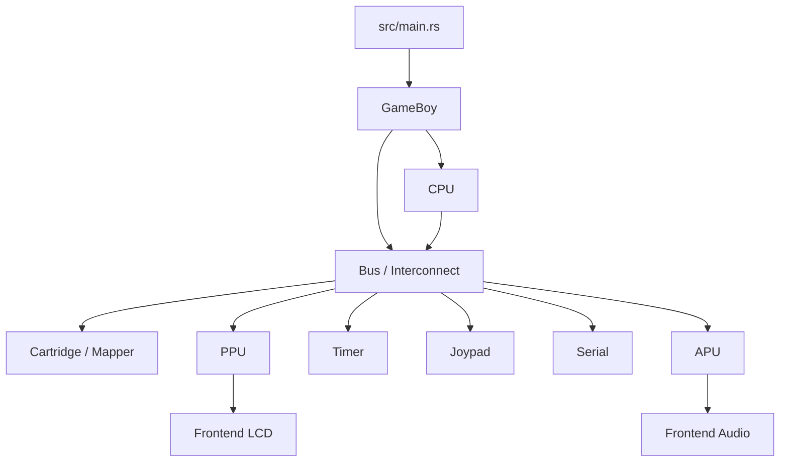

# GameGirl Game Boy Emulator Implementation Specification

This document describes the implementation target for GameGirl's DMG-first
emulator core. It is intentionally more concrete than the architecture overview:
use it when planning phases, reviewing subsystem boundaries, or deciding whether a
hardware behavior belongs in CPU, Bus, Cartridge, Timer, PPU, Joypad, Serial, APU,
or host frontend code.

## 1. Scope

GameGirl first targets DMG-compatible `.gb` ROM execution. `.gbc` files may be
loaded for header inspection, but CGB-only execution is out of scope until a later
milestone. The cartridge CGB flag at `0x0143` drives this policy:

- `0x80`: CGB-enhanced but DMG-compatible. Allow execution in DMG mode.
- `0xC0`: CGB-only. Return an unsupported-mode error in DMG-first mode.

The initial compatibility target is ROM-only and MBC1 DMG software, plus
capability-appropriate test ROMs. The validation ladder should start with
focused unit tests, then use blargg CPU/timing ROMs, selected mooneye acceptance
tests, and eventually `dmg-acid2` for PPU behavior.

Explicit non-goals for the first hardware-accurate milestones:

- Super Game Boy behavior.
- Full link cable emulation.
- Full CGB mode: CGB registers, VRAM/WRAM banking, palettes, HDMA, double speed.
- Cycle-perfect reproduction of every hardware bug.
- Save states, debugger UI, and complete host frontend polish.

The design must still leave room for those features by keeping CPU, Bus,
Cartridge, Timer, PPU, Joypad, Serial, APU, and host frontend responsibilities
separate.

## 2. Design Principles

CPU code must not read ROM, WRAM, VRAM, OAM, I/O registers, HRAM, or IE directly.
It should use a CPU-visible address interface:

```rust
bus.read8(addr)
bus.write8(addr, value)
```

`Bus` or `Interconnect` is an address router, not a generic byte array. Reads and
writes may be routed to cartridge mapper state, boot ROM overlay, PPU memory,
timer/divider registers, serial state, joypad row selection, DMA state, interrupt
registers, HRAM, or ordinary WRAM.

Time should be modeled around machine cycles. In normal DMG speed:

- 1 M-cycle = 4 dots.
- 1 scanline = 456 dots.
- 1 frame = 70224 dots.
- Visible frame size = 160 x 144 pixels.

CPU execution can initially return a `StepResult.machine_cycles`, but the
machine-level loop should consume those cycles and tick devices in M-cycle units.
Later accuracy work can move ticks inside instruction micro-steps without
changing the device ownership model.

## 3. Target Module Layout

Keep the current files until splitting removes real complexity. The intended
destination structure is:

```text
src/
├── main.rs
├── lib.rs
├── gameboy.rs
├── bus.rs
├── memory.rs
├── cartridge/
│   ├── mod.rs
│   ├── header.rs
│   ├── mbc.rs
│   ├── mbc0.rs
│   ├── mbc1.rs
│   ├── mbc3.rs
│   └── mbc5.rs
├── cpu/
│   ├── mod.rs
│   ├── registers.rs
│   ├── instruction.rs
│   ├── opcode.rs
│   ├── alu.rs
│   └── interrupt.rs
├── ppu/
│   ├── mod.rs
│   ├── registers.rs
│   ├── tile.rs
│   ├── oam.rs
│   └── palette.rs
├── timer.rs
├── joypad.rs
├── serial.rs
├── apu/
│   ├── mod.rs
│   ├── channel1.rs
│   ├── channel2.rs
│   ├── channel3.rs
│   ├── channel4.rs
│   └── mixer.rs
└── frontend/
    ├── mod.rs
    ├── lcd.rs
    └── audio.rs
```

The first split should be `cartridge/` once mapper behavior arrives. Keep
frontend backends outside the emulator core. The core should expose framebuffer,
audio samples, and input APIs rather than depending on SDL, winit, or a specific
audio backend.

## 4. Top-Level API

The public emulator owner should coordinate CPU, Bus/Interconnect, cartridge,
RAM, and devices.

```rust
pub struct GameBoy {
    cpu: Cpu,
    bus: Bus,
    mode: EmulationMode,
}

pub struct EmulatorOptions {
    pub boot_rom: Option<Vec<u8>>,
    pub boot_mode: BootMode,
    pub strict_header: bool,
}

impl GameBoy {
    pub fn new(cartridge: Cartridge, options: EmulatorOptions) -> Result<Self, EmulatorError>;
    pub fn step_instruction(&mut self) -> Result<StepReport, EmulatorError>;
    pub fn run_frame(&mut self) -> Result<Option<&[u32]>, EmulatorError>;
    pub fn frame_buffer(&self) -> &[u32];
}
```

`Cpu::step` executes one instruction and reports the consumed M-cycles:

```rust
pub struct CpuStep {
    pub opcode: u8,
    pub pc_before: u16,
    pub machine_cycles: u8,
    pub halted: bool,
}
```

The machine owner consumes those cycles:

```rust
for _ in 0..step.machine_cycles {
    self.tick_mcycle();
}
```

`tick_mcycle` advances Timer, Serial, DMA, PPU timing/access state, and interrupt
hooks without requiring CPU opcode implementations to know device internals.

## 5. CPU-Visible Memory Map

`Bus` implements the 16-bit CPU-visible address space.

| Address | Name | Owner | Read | Write |
| --- | --- | --- | --- | --- |
| `0000-3FFF` | ROM bank 00 | Cartridge mapper or boot ROM overlay | fixed ROM bank or boot ROM | MBC control unless boot overlay blocks it |
| `4000-7FFF` | ROM bank NN | Cartridge mapper | selected ROM bank | MBC control |
| `8000-9FFF` | VRAM | PPU | VRAM unless locked | VRAM unless locked |
| `A000-BFFF` | External RAM | Cartridge mapper | RAM, RTC, or open value | RAM, RTC, or ignored |
| `C000-CFFF` | WRAM bank 0 | WRAM | WRAM | WRAM |
| `D000-DFFF` | WRAM bank 1 | WRAM | WRAM | WRAM |
| `E000-FDFF` | Echo RAM | WRAM mirror | mirror of `C000-DDFF` | mirror write |
| `FE00-FE9F` | OAM | PPU | OAM unless locked | OAM unless locked |
| `FEA0-FEFF` | Not usable | Bus | DMG-compatible unusable value | ignore |
| `FF00` | JOYP | Joypad | selected active-low row | row select bits |
| `FF01-FF02` | Serial | Serial | SB/SC | SB/SC side effects |
| `FF04-FF07` | Timer | Timer | DIV/TIMA/TMA/TAC | reset/timer control side effects |
| `FF0F` | IF | Interrupts | request flags | request flags |
| `FF10-FF26` | APU regs | APU | sound regs | sound regs |
| `FF30-FF3F` | Wave RAM | APU | wave RAM | wave RAM |
| `FF40-FF4B` | LCD/PPU regs | PPU | LCDC/STAT/LY/etc. | PPU register side effects |
| `FF46` | OAM DMA | DMA/PPU | last value | start DMA |
| `FF50` | Boot ROM disable | Boot ROM policy | implementation-defined | one-way boot ROM unmap |
| `FF80-FFFE` | HRAM | HRAM | HRAM | HRAM |
| `FFFF` | IE | Interrupts | enable flags | enable flags |

Echo RAM is not separate storage. It mirrors `C000-DDFF`. VRAM and OAM access
must be gated by PPU mode hooks even before full rendering exists. The execution
path should expose side-effecting `read8`/`write8`; debugging and disassembly
should use `peek8` to avoid triggering MMIO behavior.

## 6. Cartridge and Mapper

`Cartridge::from_bytes` requires at least `0x150` bytes and parses the header at
`0x0100-0x014F`. Required metadata includes:

```rust
pub struct CartridgeHeader {
    pub entry_point: [u8; 4],
    pub nintendo_logo: [u8; 48],
    pub title: String,
    pub cgb_flag: u8,
    pub new_licensee: [u8; 2],
    pub sgb_flag: u8,
    pub cartridge_type_code: u8,
    pub rom_size_code: u8,
    pub ram_size_code: u8,
    pub destination_code: u8,
    pub old_licensee_code: u8,
    pub mask_rom_version: u8,
    pub header_checksum: u8,
    pub global_checksum: u16,
}
```

Header checksum should be computed and exposed. Strict or boot-policy mode may
reject invalid header checksums. Global checksum is useful metadata but should not
block loading by default. Title parsing must account for newer headers where
manufacturer code and CGB flag overlap the old title range.

Runtime cartridge access goes through a mapper trait:

```rust
pub trait Mapper {
    fn read_rom(&self, addr: u16) -> u8;
    fn write_ctrl(&mut self, addr: u16, value: u8);
    fn read_eram(&self, addr: u16) -> u8;
    fn write_eram(&mut self, addr: u16, value: u8);
}
```

Implementation order:

1. `NoMbc`: fixed ROM reads, optional external RAM window, ignored control writes.
2. `Mbc1`: RAM enable, lower ROM bank bits, upper ROM/RAM bank bits, banking mode,
   and bank-zero remapping.
3. `Mbc3`: basic ROM/RAM banking first; RTC ticking/latching later.
4. `Mbc5`: basic ROM/RAM banking; rumble later.

Save persistence should wait until external RAM semantics are reliable.

## 7. CPU

CPU state includes `A, F, B, C, D, E, H, L, SP, PC`. The `F` register stores
`Z, N, H, C` in bits 7, 6, 5, and 4; lower bits remain zero. `AF`, `BC`, `DE`,
and `HL` should be exposed as register-pair helpers.

Boot-skip DMG defaults should be explicit and centralized. Representative
post-boot values include `PC=0x0100`, `SP=0xFFFE`, `A=0x01`, `B=0x00`,
`C=0x13`, `D=0x00`, `E=0xD8`, `H=0x01`, and `L=0x4D`, with flags and MMIO
defaults handled by boot policy.

Instruction execution should use base and CB-prefixed opcode tables. The opcode
table should track mnemonic, length, taken cycles, optional not-taken cycles, and
flag behavior. Conditional `JP`, `JR`, `CALL`, and `RET` must distinguish
taken/not-taken timings.

Implementation order:

1. Loads: register, immediate, `[HL]`, `LDH`, `LDI`, `LDD`, absolute loads.
2. 8-bit ALU: `ADD`, `ADC`, `SUB`, `SBC`, `AND`, `OR`, `XOR`, `CP`, `INC`, `DEC`.
3. 16-bit arithmetic: `ADD HL,rr`, `INC rr`, `DEC rr`, `ADD SP,e8`,
   `LD HL,SP+e8`.
4. Rotates/shifts: base rotates and CB `RLC/RL/RRC/RR/SLA/SRA/SWAP/SRL`.
5. CB bit operations: `BIT`, `SET`, `RES`.
6. Control flow: `JP`, `JR`, `CALL`, `RET`, `RETI`, `RST`.
7. Stack: `PUSH`, `POP`.
8. Misc: `NOP`, `DAA`, `CPL`, `SCF`, `CCF`, `DI`, `EI`, `HALT`, `STOP`.

`DAA`, delayed `EI`, `RETI`, interrupt service timing, and HALT edge cases need
targeted tests.

## 8. Interrupts

`IME` is CPU-internal. `IE` is mapped at `0xFFFF`; `IF` is mapped at `0xFF0F`.
Interrupt bits:

| Bit | Interrupt | Vector | Source |
| --- | --- | --- | --- |
| 0 | VBlank | `0x0040` | PPU enters Mode 1 |
| 1 | LCD STAT | `0x0048` | STAT condition |
| 2 | Timer | `0x0050` | TIMA overflow |
| 3 | Serial | `0x0058` | serial transfer complete |
| 4 | Joypad | `0x0060` | selected input high-to-low |

Interrupt requests set `IF` bits. Handler dispatch requires `IME == true` and
`IE & IF != 0`. The lowest numbered pending bit wins. Dispatch clears IME,
clears the selected IF bit, pushes current PC, jumps to the vector, and consumes
5 M-cycles. `EI` enables IME after the following instruction.

## 9. Timer

Timer registers:

| Address | Register | Meaning |
| --- | --- | --- |
| `FF04` | DIV | divider register |
| `FF05` | TIMA | timer counter |
| `FF06` | TMA | timer modulo |
| `FF07` | TAC | enable and clock select |

Use an internal system counter rather than an isolated `DIV` byte. `DIV` exposes
part of the counter and resets to zero on any write. `TAC` selects the counter bit
whose falling edge increments `TIMA`. Basic timer work can start with a simpler
frequency counter, but the type should be shaped so falling-edge behavior and the
one-M-cycle TIMA reload delay can be added without changing Bus APIs.

## 10. PPU

PPU owns VRAM, OAM, LCD registers, timing state, and framebuffer:

```rust
pub struct Ppu {
    vram: [u8; 0x2000],
    oam: [u8; 0xA0],
    regs: PpuRegisters,
    mode: PpuMode,
    dot_in_line: u16,
    framebuffer: [u32; 160 * 144],
    frame_ready: bool,
}
```

Timing:

- Mode 2 OAM scan: 80 dots.
- Mode 3 drawing: variable, roughly 172-289 dots.
- Mode 0 HBlank: remainder of the 456-dot line.
- Mode 1 VBlank: 10 lines, `LY=144..153`.

Register baseline:

| Address | Name | Purpose |
| --- | --- | --- |
| `FF40` | LCDC | LCD, BG/window/OBJ controls |
| `FF41` | STAT | mode, LYC=LY, STAT interrupt enables |
| `FF42` | SCY | BG scroll Y |
| `FF43` | SCX | BG scroll X |
| `FF44` | LY | current scanline |
| `FF45` | LYC | LY compare |
| `FF46` | DMA | OAM DMA start |
| `FF47` | BGP | DMG BG palette |
| `FF48` | OBP0 | DMG OBJ palette 0 |
| `FF49` | OBP1 | DMG OBJ palette 1 |
| `FF4A` | WY | window Y |
| `FF4B` | WX | window X |

Rendering should progress BG first, then window, then sprites, then timed DMA
and access restrictions, then Mode 3 penalties. `dmg-acid2` should not be treated
as an early milestone gate until sprite/window/DMA behavior exists.

## 11. Joypad

`FF00` is an active-low 2 x 4 matrix. Bit 5 selects action buttons; bit 4 selects
d-pad buttons. Selection and pressed state are both active-low from the CPU view.

```rust
pub enum Button {
    Right,
    Left,
    Up,
    Down,
    A,
    B,
    Select,
    Start,
}
```

Writes update row selection. Reads return the selected row. A high-to-low
transition on a selected input requests the Joypad interrupt.

## 12. Serial

`FF01` is SB and `FF02` is SC. Early validation only needs deterministic test ROM
output capture. When `SC` is written with transfer start and internal clock
selected, append `SB` to a serial output buffer, clear transfer-start state, and
request Serial interrupt. Exact bit timing and external clock behavior can follow.

## 13. APU

APU is a later milestone, but register stubs should not block reads/writes in the
I/O window. Future APU work should model:

1. Register read/write and audio power state.
2. CH1 pulse with sweep.
3. CH2 pulse.
4. CH3 wave RAM.
5. CH4 LFSR noise.
6. Frame sequencer: length, sweep, envelope.
7. Mixer: NR50, NR51, stereo samples.
8. Frontend audio queue.

## 14. CLI and Frontend

Future CLI options:

```text
game-girl <rom.gb|rom.gbc>
    --boot-rom <path>
    --headless
    --frames <n>
    --serial-log
    --save-path <path>
    --scale <n>
```

Official boot ROM bytes must not be shipped. If a boot ROM path is absent,
GameGirl uses post-boot DMG defaults and starts at `0x0100`. If a boot ROM path
is present, CPU starts at `0x0000`, boot ROM overlays cartridge reads at the low
address range, and `FF50` permanently unmaps it.

## 15. Error Handling

Use structured errors at library boundaries and short messages in the CLI.

```rust
pub enum EmulatorError {
    Io(std::io::Error),
    Cartridge(CartridgeError),
    UnsupportedMode(UnsupportedMode),
    InvalidOption(String),
}

pub enum CartridgeError {
    TooShort { len: usize },
    InvalidLogo,
    InvalidHeaderChecksum { expected: u8, actual: u8 },
    UnsupportedCartridgeType(u8),
    UnsupportedRomSize(u8),
    UnsupportedRamSize(u8),
    RomLengthMismatch { expected: usize, actual: usize },
}
```

Unsupported CGB-only ROMs, unsupported MBCs, ROM length mismatches, and illegal
opcodes should stop deterministically instead of panicking in normal runs.

## 16. Validation Strategy

Unit tests:

- Cartridge: header parsing, checksums, size codes, CGB flag, mapper choice.
- Mapper: NoMbc, MBC1, MBC3, MBC5 focused bank fixtures.
- Bus: full address map, Echo RAM, unusable range, `peek8`, VRAM/OAM gates.
- CPU: flags, ALU, control flow, stack, CB opcodes, DAA, EI delay, interrupts.
- Timer: DIV reset, TAC frequency, TIMA overflow/reload, IF request.
- PPU: tile decode, palettes, BG scanline, sprite selection, LY/LYC/STAT.

Integration tests should run headless with frame or instruction limits. Serial
output, memory signatures, or reference images can be pass criteria depending on
the ROM. Unsupported fixtures should be skipped by capability classification
rather than counted as emulator failures.

## 17. Roadmap Alignment

This specification maps to the v1.1 roadmap as follows:

- Phase 6: cartridge loading, header policy, CGB classification, mapper boundary.
- Phase 7: complete CPU-visible address routing and side-effect-free `peek8`.
- Phase 8: device-backed MMIO for interrupts, joypad, timer, serial, DMA, PPU access hooks.
- Phase 9: boot policy, top-level machine ownership, M-cycle ticking.
- Phase 10: MBC1/MBC3/MBC5 basics and capability-gated ROM harness.

Later milestones can then complete CPU opcode coverage, timer/interrupt precision,
PPU rendering, APU output, save persistence, CGB execution, and specialty
cartridge compatibility.

## 18. Architecture Delta

The long-term runtime shape should look like this:



Data flow:

1. CLI parses ROM path and emulator options.
2. `Cartridge::from_bytes` parses header metadata and selects mapper behavior.
3. `GameBoy::new` initializes CPU, Bus/Interconnect, cartridge, RAM, and devices.
4. CPU executes through the Bus/Interconnect only.
5. Machine-level M-cycle ticks advance Timer, PPU, Serial, DMA, and interrupt hooks.
6. PPU publishes completed frames to the frontend.
7. APU eventually publishes samples to an audio backend.
8. Frontend input updates Joypad and may request interrupts.

## References

- [Pan Docs: The Cartridge Header](https://gbdev.io/pandocs/The_Cartridge_Header.html)
- [Pan Docs: Memory Map](https://gbdev.io/pandocs/Memory_Map.html)
- [Pan Docs: Rendering](https://gbdev.io/pandocs/Rendering.html)
- [Pan Docs: Power-Up Sequence](https://gbdev.io/pandocs/Power_Up_Sequence.html)
- [Pan Docs: MBCs](https://gbdev.io/pandocs/MBCs.html)
- [Pan Docs: CPU Registers and Flags](https://gbdev.io/pandocs/CPU_Registers_and_Flags.html)
- [Pan Docs: CPU Instruction Set](https://gbdev.io/pandocs/CPU_Instruction_Set.html)
- [Game Boy CPU opcode table](https://gbdev.github.io/gb-opcodes/optables/)
- [Pan Docs: Interrupts](https://gbdev.io/pandocs/Interrupts.html)
- [Pan Docs: Timer and Divider Registers](https://gbdev.io/pandocs/Timer_and_Divider_Registers.html)
- [Pan Docs: Timer Obscure Behaviour](https://gbdev.io/pandocs/Timer_Obscure_Behaviour.html)
- [Pan Docs: LCD Control](https://gbdev.io/pandocs/LCDC.html)
- [Pan Docs: OAM](https://gbdev.io/pandocs/OAM.html)
- [Pan Docs: OAM DMA Transfer](https://gbdev.io/pandocs/OAM_DMA_Transfer.html)
- [Pan Docs: Joypad Input](https://gbdev.io/pandocs/Joypad_Input.html)
- [Pan Docs: Audio](https://gbdev.io/pandocs/Audio.html)
- [Pan Docs: Audio Registers](https://gbdev.io/pandocs/Audio_Registers.html)
- [blargg Game Boy test ROM mirror](https://github.com/retrio/gb-test-roms)
- [mooneye-test-suite](https://github.com/Gekkio/mooneye-test-suite)
