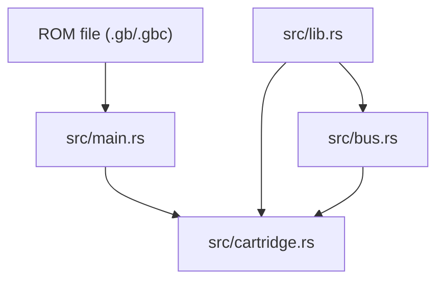

<!-- generated-by: gsd-doc-writer -->
# アーキテクチャ

GameGirl は Rust 製の Game Boy エミュレータ基盤です。現在の実行ファイルは `.gb` / `.gbc` の ROM パスを受け取り、ROM をバイナリとして読み込み、カートリッジヘッダーを表示し、再利用可能な cartridge / bus モジュールを公開します。

## システム概要

このプロジェクトは、小さな Rust バイナリと再利用可能なライブラリ crate に分かれています。`src/main.rs` は CLI 引数、ユーザー向けエラー、ヘッダー表示を担当します。エミュレータ本体の処理は `src/lib.rs` 配下にあり、現在は `cartridge` と `bus` モジュールを公開しています。

現在の主な入力は ROM ファイルです。出力は、読み込んだバイト数、解析したヘッダー情報、または読み込み・解析エラーです。

## コンポーネント図



## データフロー

1. `src/main.rs` が最初の CLI 引数を読み、拡張子が `.gb` または `.gbc` か確認します。
2. CLI は `std::fs::read` で ROM をバイナリ bytes として読みます。
3. `CartridgeHeader::parse` がカートリッジヘッダーを解析し、タイトル、カートリッジ種別、ROM/RAM サイズなどを表示します。
4. `Cartridge::from_bytes` が ROM/RAM size code を検証し、既知の cartridge type code を metadata として認識します。未知の種別は `UnsupportedCartridgeType` として明示的に拒否します。
5. `Bus::new` は `Cartridge` を受け取り、ROM、WRAM、OAM、I/O、HRAM、IE など、現在実装済みの CPU 可視メモリ範囲を所有します。
6. 今後の CPU 実装は、ROM や RAM を直接読むのではなく `Bus::read8` / `Bus::write8` を通してアクセスします。

## 主要な抽象化

| 抽象化 | 場所 | 役割 |
|--------|------|------|
| `Cartridge` | `src/cartridge.rs` | ROM bytes を所有し、bank-controller 実装前の固定 ROM read を提供します。 |
| `CartridgeHeader` | `src/cartridge.rs` | タイトル、種別、サイズ、チェックサム、エントリポイント、ロゴ、CGB flag などのヘッダー情報を保持します。 |
| `CartridgeType` | `src/cartridge.rs` | 既知の cartridge metadata type code と未知の type code を区別します。 |
| `CartridgeError` | `src/cartridge.rs` | I/O、短すぎる ROM、未対応種別、未対応 ROM/RAM サイズなどのエラーを表します。 |
| `validate_rom_bytes` | `src/cartridge.rs` | ROM がカートリッジヘッダー領域を含む長さか確認します。 |
| `load_rom_file` | `src/cartridge.rs` | CLI 用に ROM ファイルを読み込み、検証したうえで raw bytes を返します。 |
| `load_cartridge_file` | `src/cartridge.rs` | ROM ファイルを `Cartridge` として読み込みます。 |
| `Bus` | `src/bus.rs` | 16-bit アドレス空間の read/write を、カートリッジ ROM や内部メモリへルーティングします。 |
| `Bus::read8` | `src/bus.rs` | DMG アドレス空間から 1 byte 読みます。 |
| `Bus::write8` | `src/bus.rs` | 書き込み可能な範囲へ 1 byte 書き込み、未使用範囲は無視します。 |

## ディレクトリ構成

```text
.
├── Cargo.toml
├── src/
│   ├── main.rs
│   ├── lib.rs
│   ├── cartridge.rs
│   └── bus.rs
├── tests/
│   └── cli.rs
├── docs/
│   ├── hot_to_proceed.md
│   ├── gameboy_architecture_summary.md
│   └── ja/
├── roms/
│   ├── blargg-gb-tests/
│   ├── hello-world/
│   └── mooneye/
└── .github/
    └── workflows/
```

- `src/main.rs` は薄い CLI 境界として保ちます。
- `src/lib.rs` はエミュレータ部品を公開する crate API です。
- `src/cartridge.rs` は ROM 読み込み、ヘッダー解析、種別判定、固定 ROM 読み取りをまとめます。
- `src/bus.rs` は CPU から見えるメモリアクセスの入口です。
- `tests/cli.rs` はコンパイル済みバイナリの振る舞いを外側から確認します。
- `roms/` は将来の検証に使う ROM fixture とテスト ROM 群を置きます。
